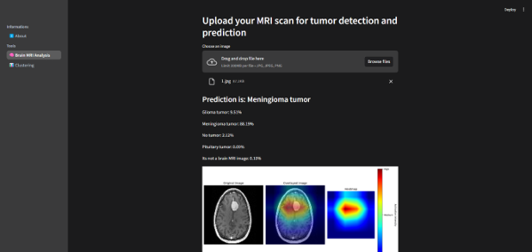
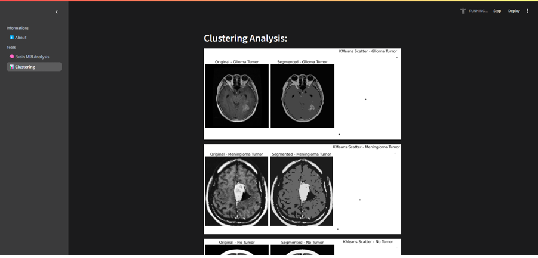

# Brain Tumor Detection and Analysis Dashboard

A simple tool designed to help analyze MRI scans, group (cluster) tumor images, and predict brain tumor types using machine learning. This project is built mainly for educational purposes to demonstrate how AI and data visualization can be used in medical imaging.


## 🚀 Features

- **MRI Upload and Prediction**: Upload MRI images to predict tumor types with a pre-trained EfficientNet model.
- **Clustering Analysis**: Visualize and analyze clustering on random tumor images from predefined datasets using KMeans clustering.
- **Interactive Dashboard**: Navigate between information, prediction, and clustering tools in a user-friendly interface powered by Streamlit.

## 🛠️ Technologies Used

- **Streamlit**: For creating the interactive web-based interface.
- **TensorFlow/Keras**: For training and utilizing deep learning models.
- **KMeans Clustering**: For segmenting tumor images.
- **OpenCV**: For image preprocessing and visualization.
- **Matplotlib**: For visualizing clustering and Grad-CAM results.
  
## 🖥️ Setup and Installation

1. Clone this repository:
   ```bash
   https://github.com/kyprosantreou/Brain-Tumor-Detection.git
   cd Brain-Tumor-Detection
   ```
2. Create a virtual environment and activate it:
   ```bash
   python -m venv venv
    source venv/bin/activate       # For Linux/macOS
    venv\Scripts\activate          # For Windows
   ```
3. Install the required prerequisites:
   ```bash
   pip install -r requirements.txt
   ```
4. Run the program:
    ```bash
    streamlit run main.py
    ```
## 🔍 How to Use
  Informations:
  Learn more about the project in the "About" section.
  
  Tools:
  - Brain MRI Analysis: Upload an MRI image and get predictions on tumor type with confidence scores.
  - Clustering: Explore segmented images and analyze KMeans clustering applied to tumor datasets.
  - Grad-CAM Visualization: Interpret the model's predictions using heatmaps that highlight important areas in the uploaded       MRI scan.

## 🧪 Sample Results
  Prediction Example:
  
   

  Clustering Example:
  
   


🧑‍💻 Author:

Developed by Kypros Andreou. If you have any questions or feedback, feel free to reach out!
